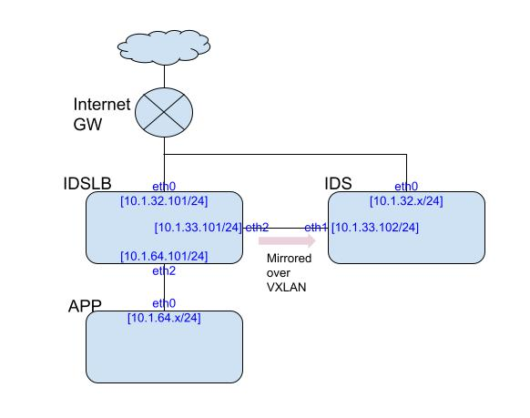

개요
==========================
* 이 문서는 NHN클라우드 환경에서, Gateway역활의 VM의 in/out 패킷을 VXLAN을 통해서 IDS역활을 하는 다른 VM으로 미러링하는 구성을 terraform기반으로 자동화하는 방식에 대해서 설명합니다.

전체 구성 개요
=========================
* 네트워크 구성
    * IDSLB 인스턴스에서 eth0 로 in/out 되는 패킷을  IDSLB eth1와 IDS eth1사이에 생성된 vxlan tunnel을 통해서, IDS로 전송합니다.
    * 
* 본 테라픔으로 자동으로 구성되는 리소스는 아래 같습니다.
    * openstack_networking_port_v2.app_internal
    * openstack_networking_port_v2.ids_external
    * openstack_networking_port_v2.ids_mirror
    * openstack_networking_port_v2.idslb_external
    * openstack_networking_port_v2.idslb_internal
    * openstack_networking_port_v2.idslb_mirror
    * openstack_compute_instance_v2.app
    * openstack_compute_instance_v2.ids
    * openstack_compute_instance_v2.idslb
    * openstack_networking_floatingip_v2.app_public_ip
    * openstack_networking_floatingip_v2.ids_public_ip
    * openstack_networking_floatingip_v2.idslb_public_ip
    * openstack_compute_floatingip_associate_v2.app_public_ip
    * openstack_compute_floatingip_associate_v2.ids_public_ip
    * openstack_compute_floatingip_associate_v2.idslb_public_ip
* 본 테라폼 적용 전 사전에 사용자에 의해서 구성되거나 생성되어야 하는 리소스는 아래와 같습니다.
    * data.openstack_networking_network_v2.vpc_network
    * data.openstack_networking_router_v2.router
    * data.openstack_networking_subnet_v2.subnets["external"]
    * data.openstack_networking_subnet_v2.subnets["internal"]
    * data.openstack_networking_subnet_v2.subnets["mirror"]


사용법
======================
* 전체 절차 개요
    1. 인프라 구성 설계 및 NHN 클라우드 콘솔의 사용자 정보 확인
    1. NHN 클라우드 콘솔에서, VPC 및 subnet을 신규 생성하거나 설정
    1. 테라폼 적용
    1. NHN 클라우드 콘솔에서, 라우터 설정
    1. 테라폼 재 적용
* 사전 확인 필요 사항
    * NHN 클라우드 콘솔에 접속하여, 사용자 정보(user_name/tenant_id/password) 확인
        * https://docs.toast.com/ko/Compute/Instance/ko/terraform-guide/ 의 "Terraform 초기화" 부분의 user_name, tenant_id, password, auth_url, region 정보를 확인하는 방법을 참고하여, 해당 정보를 확인합니다.
* 상세 절차
    1. 전체 인프라 구성 설계
        * 앞의 전체 구성 개요에서 기술한 바와 같은 네트워크 구성을 가정하고 있습니다.
            * subnet: external(10.1.32.0/24), mirror(10.1.33.0/24), internal(10.1.64.0/24)
            * 인스턴스의 인터페이스 IP 주소 할당
                * IDSLB: eth0-10.1.32.101, eth1-10.1.33.101, eth2-10.1.64.101
                * IDS: eth0-자동할당, eth1-10.1.33.102
                * APP: eth0-자동할당
            * 인스턴스의 floating IP 주소 할당: 자동할당
        * 앞의 subnet의 네트워크 주소 및 각 인스턴스의 인터페이스 주소 할당은 VPC나 subnet 환경에 따라 변경하는 것은 가능합니다만, 반드시 사전에 네트워크 주소 및 자동할당이 아닌 각 인스턴스에 사전에 정의된 IP주소는 테라폼 적용 전 확정되어야 합니다.
    1. NHN클라우드 콘솔에서 VPC /subnet/키페어/보안그룹 신규 생성하거나 설정하고 정보 확인
        * 주의: 분산형 라우팅 미지원 및 라우팅 방식 변경 관련 주의 사항
            * 본 테라폼의 적용은 NHN클라우드의 "네트워크"-"라우팅" 서비스의 각 "라우팅 테이블" 의 "라우팅 방식"에서 기존 분산형 라우팅(DVR)이 아닌 중앙 집중형 라우팅(CVR)에서만 동작합니다.
            * 본 테라폼이 정상 적용되려면, 중앙 집중 라우팅(CVR)이 적용된 신규 VPC를 생성하거나 기존 생성된 VPC의 라우팅 테이블의 "라우팅 방식"을 DVR에서 CVR로 변경해야 합니다.
            * "라우팅 방식" 변경 시, 전반적인 해당 VPC내부의 네트워크 기능이 수분간 정상동작 하지 않으므로, 리우팅 방식 변경은 테스트 환경 혹은 네트워크의 수분 간 단절의 영향력이 없는 경우에만 실행해야 됩니다.
        * 앞서 기술된 바와 같이 기존 VPC 또는 신규 VPC의 Internet GW 에 바인드 되어 있는 "라우팅 테이블"을 신규로 생성하거나 기존 라우팅 테이블의 "라우팅 방식"을 DVR에서 PVR로 변경합니다.
            * VPC 생성 시, CIDR은 적절히 설정 가능합니다.
            * 다만 전체적으로 앞서 설계 과정에서 subnet 주소 및 각 인스턴스의 IP 주소 할당 설계에 부합하는 CIDR 설정이 필요함을 유의해 주시기 바랍니다.다른 특별한 이유가 없으면 본 가이드의 10.1.0.0/16을 권장합니다. 
        * 생성하거나 수정한 VPC 의 이름과 "라우팅 테이블"의 이름을 정확히 확인합니다.
        * VPC 내부에 아래와 같은 세개의 subnet을 생성합니다. 생성 시 각 서브넷의 네트워크 주소(CIDR)는 적절히 생성 가능하지만, 앞서 전체적인 VPC CIDR/네트워크/인터페이스 주소 할당 설계에 부합하도록 설정 필요합니다.
            * external: 10.1.32.0/24
            * mirror: 10.1.33.0/24
            * internal: 10.1.64.0/24
        * 키페어는 신규 생성된 IDSLB/IDS/APP 인스턴스의 SSH 접속을 위하여 사용하므로, 키페어 정보를 주의 깊게 확인합니다. 기존에 설정된 키페어를 재활용하거나 혹은 해당 테스트 환경을 위해서 신규로 키페이를 생성합니다. 아래 예제에서는 "ids-mirror-test" 라는 이름으로 신규 키페어로 사용자가 NHN클라우드 콘솔에서 직접 키페어를 생성한 것을 가정하였습니다.
        * 보안그룹은 기존의 보안 그룹을 사용하거나 신규 보안 그룹을 설정합니다. 단 해당 보안 그룹을 원활한 관리 접근과 기능 테스트를 위해서, 아래 Inbound 룰의 설정을 권고 합니다.
            * 클라이언트의 SSH inboud 접근 허용
            * 클라이언트의 ICMP inboud 접근 허용( ICMP echo request/reponse를 통한 네트워크 접속 테스트 용도) 
            * VXLAN을 위한 UDP 4789 포트의 inboud 접근 허용
    1. 네트워크 설계 및 NHN클라우드 환경에 따른 테라폼 설정
        * 본 테라폼을 적용하기 위해서 반드시 사용자가 수정을 해야 하는 정보의 template 은 terraform.tfvars.example 파일에 기술되어 있습니다.
        * 테라폼이 적용될 때 실제 동작하는 변수 설정 파일은 terraform.tfvars 이므로, 아래와 같이 terraform.tfvars.example 을 terraform.tfvars 로 copy한 후, 적절한 편집기로 terraform.tfvars 파일을 열어서 앞서 네트워크 설계 및 NHN 클라우드 환경에 맞는 값으로 설정합니다.
        *  terraform.tfvars 파일 예제
            ```
            provider_user_name   = "xxx@xxx.com"     => NHN콘솔의 사용자 ID 
            provider_tenant_id   = "0123456789abcdefg012345678901234" => 프로젝트별 ID
            provider_password    = "xxxxxxxxxx"   => NHN콘솔의 사용자 password
            vpc = "ids_test_vpc"      => VPC 이름 
            vpc_router = "vpc-e0123456-abcd"      => VPC의 라우팅 테이블 이름
            idslb_external_interface_ip  = "10.1.32.101"  => IDSLB인스턴스의 external subnet IP
            idslb_mirror_interface_ip  = "10.1.33.101"  => IDSLB인스턴스의 mirror subnet IP
            idslb_internal_interface_ip  = "10.1.64.101" => IDSLB인스턴스의 internal subnet IP
            ids_mirror_interface_ip = "10.1.33.102" => IDS인스턴스의 mirror subnet IP
            keypair = "ids-mirror-test" => 인스턴스 접속을 위한 SSH 키페어

            ```            
        * 위 설정외에 추가적으로 설정 가능한 사용자 옵션은 variable.tf 파일에 정의 되어 있습니다. variable.tf 파일의 설정 중 변경이 필요한 설정은 terraform.tfvars 에 추가 설정을 합니다.
    1. 테라폼 적용하여, 인스턴스 생성 및 설정
        * terraform.tfvars 및 variable.tf에 적용되어 있는 설정 검토후, 아래와 같이 terraform init/validate/apply를 실행합니다.
            ```
            sh# terraform init
            sh# terraform validate
            sh# terraform apply
            ```
        * terraform apply 실행 결과 아래와 같이, public IP 는 각 신규 생성된 인스턴스의 외부 접속 주소이므로, 해당 정보를 유의합니다. ( 이후, terraform 실행 디렉토리에서 "terraform output" 명령어로도 동일한 정보 확인 가능합니다) 
            ```
            Outputs:

            app_public_ip = "x.x.244.29"
            ids_mirror_interface_ip = "10.1.33.102"
            ids_public_ip = "x.x.244.108"
            idslb_mirror_interface_ip = "10.1.33.101"
            idslb_public_ip = "x.x.244.109"
            ```
    1. NHN클라우드 콘솔에서, 해당 VPC 의 "라우팅 테이블" 수정
        * "internal" 서브넷으로 향하는 트래픽이 IDSLB인스턴스를 경유하도록 해당 VPC의 "라우팅 테이블" 변경이 필요합니다.
        * 현재 테라폼으로 NHN 클라우드 VPC 라우팅 설정 변경이 불가능하여, 해당 정보는 사용자가 직접 NHN 클라우드 콘솔에서 아래와 같이 설정합니다.
            * "네트워크"-"라우팅" 메뉴에 접근하여 라우팅 테이블 리스트에서, 해당 VPC 라우팅 테이블을 선택하고, 화면 하단의 "기본 정보" 탭 옆의 "라우트" 탭을 선택
            *  "라우트 생성"을 선택하여, "라우팅 생성" 팝업 화면에서, 대상 CIDR은 앞서 네트워크 설계 및 서브넷 생성 시 설정한 "internal" 서브넷의 CIDR (위의 예에서 10.1.64.0/24) 값으로 설정하고, 게이트웨이는 idslb의 external 인터페이스 IP값의 gateway ( 위의 예에서, "INSTANCE: idslb(10.1.32.101)) 을 선택
    1. 인스턴스 네트워크 접근 문제 해결을 위해서 테라폼 재 적용
        * 현재 NHN 환경에서 테라폼 사용 시, port security 와 보안 그룹 적용에 일부 문제가 있어서, 최초 테라폼 적용 "terraform apply" 실행 시, 정상적으로 인스턴스의 네트워크 접근이 이루어 지지 않습니다. 
        * 해당 문제에 대해서 근본 문제 해결이나 회피 방안에 대해서 검토 진행 중이지만, 현재 상태에서는 아래 명령어와 같이 "테라폼 재적용"을 실행하면, 문제가 해결 가능합니다.
            ```
            sh# terraform apply
            ```

정상 동작 확인 방법
========================
* 앞서 "terraform apply" 실행 결과 "Output: " 항목 또는 그 이후 "terraform output" 실행 결과에서 IDS의 public IP를 확인 합니다.
* 아래 ssh 명령어를 이용해서, IDS 인스턴스에 접속을 합니다. 만약 ssh 접속이 정상적으로 이루어 지지 않으면 앞서 설정한 보안그룹 혹은 키페어 값을 점검합니다.
    ```
    sh# ssh -i ids-mirror-test.pem ubuntu@x.x.244.108
    ```
* IDS에서 ssh로 정상 접속한 후, tcpdump 등의 명령어로 eth1 또는 vxlan0 인터페이스에 rx되는 패킷을 덤프합니다.
* 앞서 패킷 덤프가 지속적으로 실행되고 있는 상황에서,또 다른 터미널에서 APP 인스턴스의 public IP주소 ( 위 예에서 x.x.244.29 )로 ping 이나 기타 네트워크 접속 프로그램을 이용하여, APP인스턴스에 접속하는 트래픽을 생성합니다.
* 앞서 tcpdump 등을 실행한  IDS ssh 접속 터미널에 APP인스턴의 트래픽이 정상적으로 덤프가 되는 확인합니다.
    * eth1 인터페이스를 덤프한 경우에는 vxlan으로 encap된 트래픽을 확인할 수 있고, vxlan0  인터페이스를 덤프하는 경우에는 vxlan 헤더가 없어진 APP 인스트스의 트래픽과 동일한 트래픽을 확인할 수 있습니다.


주의 사항
==========================
* NHN 클라우드에 특징적인 구현
    * 본 구성의 클라우드 인프라는 NHN클라우드( https://www.toast.com/ )를 기반으로 작성하였습니다. 대부분의 기능은 다른 Openstack 기반의 private/pubic 클라우드 인프라에서도 동작하지만 각 클라우드 환경의 네트워크 구현 특성(특히 VPC 및 Internet GW 구현 특성)에 따라 일부 구성은 정상 동작하지 않습니다.
* VXLAN의 overhead 및 NHN인프라의 jumbo frame미지원으로 인한 "TCP MSS Clamping" 적용
    * 원본 패킷을 vxlan으로 encap할 경우, 50byte의 추가 헤더 overhead가 발생하게 되므로, 원본 패킷을 vxlan으로 손실 없이 보내려면, 해당 vxlan 인터페이스는 원본 패킷이 rx/tx되는 인터페이스보단 MTU 값이 50 byte가 더 커야합니다.
    * 하지만, 현재 NHN 네트워크 인프라에서는 인터페이스의 MTU값을 1500보다 크게 설정했을 때 정상 동작하지 않는 것으로 확인(추가 검증 필요) 되어서, vxlan 인터페이스의 MTU를 증가 시키는 대신, IDSLB 인스턴스가 포워팅 하는 TCP 패킷에 대해서  TCP packet의 MSS (maximum segment size) 값을 1410 byte (일반적인 MSS값은 1460byte, vxlan 50 byte overhead를 고려)로 줄이도록 조치하였습니다.
    * 해당 조치로 TCP 패킷은 정상적으로 vxlan을 통한 mirroring이 가능하지만, IP패킷 size가 1450 byte를 초과하는 UDP/ICMP등의 패킷은 정상적으로 미러링이 되지 않음에 유의합니다.


향후 개선 필요 사항
=====================
* 테라폼 최초 적용 시 네트워크 접근 문제 해결
    * 현재 테라폼 적용을 두 번 해야 하는 이슈에 대한 정확한 문제 원인을 파악하고 해결
* 현재 NHN인프라에서 테라폼으로 설정 불가능한 라우팅 정보 등의 설정을 API등을 통해서 설정
* VXLAN의 overhead 및 TCP MSS clamping  이슈 해결을 위한 터널 encap없는 패킷 전송
    * IDSLB에서 IDS로 미러 패킷 전달 시 VXLAN 터널로 encap하는 방식이 아니라, 패킷의 destination MAC주소를 IDS의 MAC 주소로 변경하여 패킷을 전달하는 방식으로 개선 가능합니ㅏ다.
    * 현재 대부분의 IDS구현에서는 MAC주소 기반으로 동작하는 보안 기능등이 거의 없으므로, 보안성 측면에서는 문제가 되지 않을 것으로 예상됩니다.
